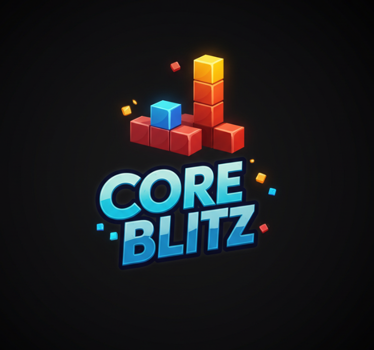
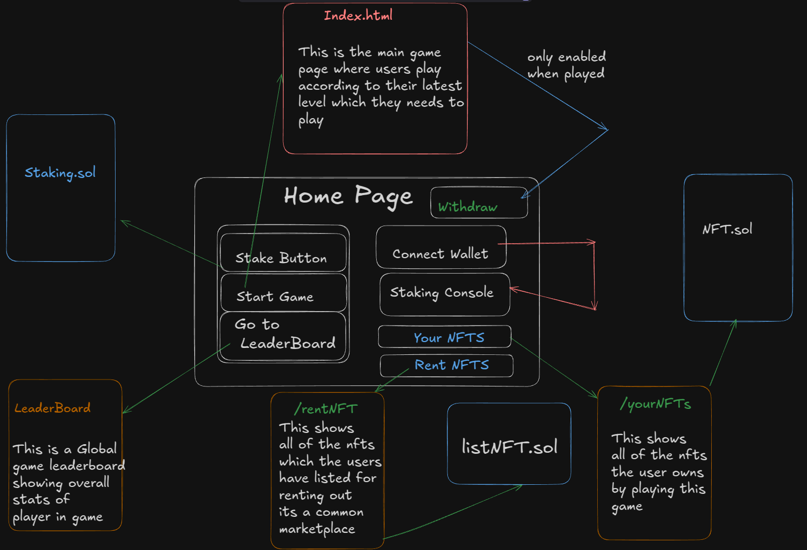

# Core Blitz

Core Blitz is an exciting **Tetris-style puzzle block game** built on **COREtoken**. Players strategically place falling blocks to clear rows and earn rewards in COREtoken. The game combines classic puzzle mechanics with blockchain-based incentives, making it both **engaging and rewarding**.




## Game Architecture



## Features
- **COREtoken Integration** – Earn and use COREtoken while playing.
- **Tetris-Inspired Mechanics** – Arrange blocks to clear rows.
- **On-Chain Rewards** – Blockchain-powered incentives for top players.
- **Leaderboard System** – Compete globally for high scores.

## How to Play
1. Start the game and log in using your Web3 wallet.
2. Use arrow keys to move and rotate blocks.
3. Complete rows to earn COREtoken rewards.
4. Aim for high scores to rank on the leaderboard!

## Installation & Setup
### Prerequisites
- Node.js & npm
- MetaMask 
- COREtoken-compatible blockchain setup on the Wallet

### Steps
1. Clone the repository:
   ```sh
   git clone https://github.com/your-repo/core-blitz.git
   cd core-blitz
   ```
2. Install dependencies:
   ```sh
   npm install
   ```
3. Start the development server:
   ```sh
   npm run dev
   ```
4. Open the game in your browser at `http://localhost:3000`

## Smart Contract
Core Blitz utilizes smart contracts for **reward distribution and game validation**. The contract ensures fairness and transparency for all players.

## Contributing
We welcome contributions! If you’d like to improve Core Blitz, feel free to:
- Submit issues & feature requests
- Create pull requests

## License
This project is open-source under the **MIT License**.

## Contact
For any queries, reach out via [email/contact link].
```

You can replace `"path/to/logo.png"` and `"path/to/architecture.png"` with actual image paths. Let me know if you need any modifications! 🚀